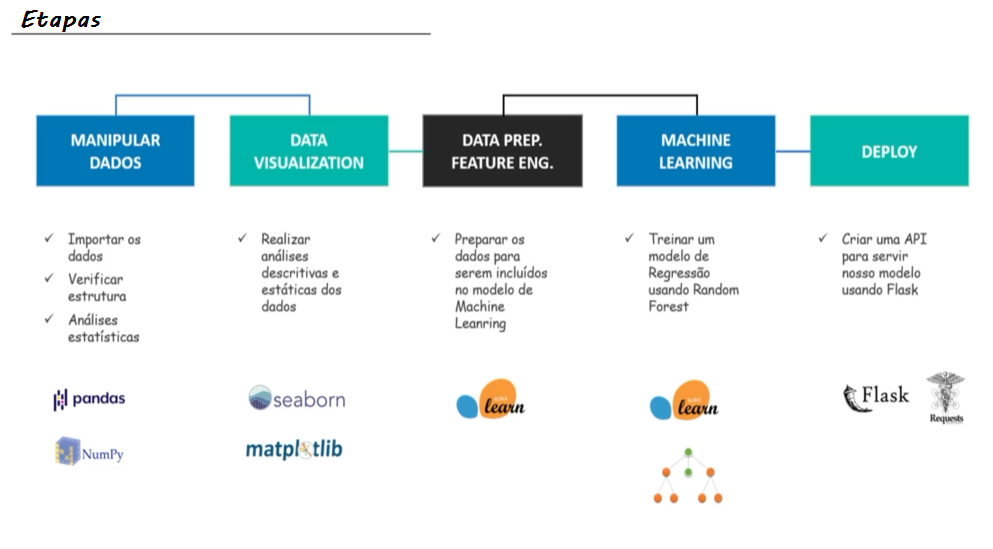

# Previsao alugueis
### Desenvolvimento de uma solução End-to-end de um modelo de previsão de valores de alugueis de imóveis em São Paulo. 

<b>Os passos 1 a 6 podem ser vistos no notebook através do link:</b> https://github.com/igorvgp/previsao_alugueis/blob/main/criacao_algoritmo.ipynb

<b>Passo 1.</b> Análise exploratória dos dados com Python no Jupyter notebook utilizando as libs:

 <b>  <ul>Pandas:</b>  Manipulação de dados

 <b>  Numpy:</b>  Álgebra linear

 <b>  Matplotlib e Seaborn:</b>  Construção de gráficos
</ul>

<b>Passo 2.</b> Engenharia de features: preparação dos dados para aplicação do modelo de Machine Learning

<b>Passo 3.</b> Criação do modelo de Machine Learning Random Forest Regressor utilizando scikit-learn

<b>Passo 4.</b> Criação do modelo de Machine Learning Random Forest Regressor utilizando scikit-learn

<b>Passo 5.</b> Avaliação do modelo com R2, MSE e graficamente.

<b>Passo 6.</b> Exportação do modelo.

<b>Passo 7.</b> Criação da API com Flask: https://github.com/igorvgp/previsao_alugueis/blob/main/aplicacao.py

<b>Passo 8.</b> Criação do banco de dados com SQL e sqlite3 para armazenar os logs da API: https://github.com/igorvgp/previsao_alugueis/blob/main/criacao_banco_de_dados.ipynb

<b>Passo 9.</b> Conexão e teste da API com Requests: https://github.com/igorvgp/previsao_alugueis/blob/main/conexao_com_API.ipynb

